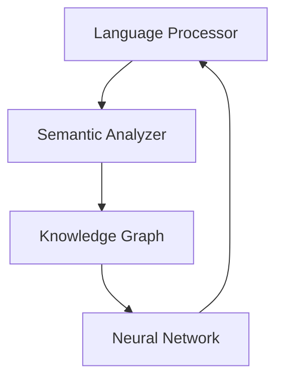

# 🧠 Neuron Interface

<div align="center">
  
  
  [](https://www.typescriptlang.org/)
  [](https://reactjs.org/)
  [](https://www.tensorflow.org/js)
  [](https://vitejs.dev/)
  [](https://tailwindcss.com/)

  *A sophisticated AI chat interface featuring neural network-based natural language processing, semantic analysis, and advanced context management, wrapped in a cyberpunk-inspired Matrix theme.*
</div>

## ✨ Features

### 🤖 Advanced Language Processing
- **Semantic Analysis Engine**: Deep understanding of context and meaning
- **Technical Content Recognition**: Automatic detection and parsing of code snippets
- **Multi-Language Support**: Comprehensive programming language knowledge base
- **Real-time Sentiment Analysis**: Dynamic emotional context tracking
- **Context-Aware Responses**: Intelligent conversation flow management

### 🔮 Neural Network Integration
- **TensorFlow.js Core**: Browser-based machine learning capabilities
- **Real-time Text Embeddings**: Advanced semantic similarity analysis
- **Pattern Recognition**: Intelligent code and context pattern detection
- **Dynamic Learning**: Continuous improvement through interaction
- **Coherence Calculation**: Ensures contextually appropriate responses

### 📚 Knowledge Management
- **Dynamic Knowledge Graph**: Interconnected concept relationships
- **Adaptive Learning**: Real-time concept and relationship learning
- **Technical Documentation**: Integrated programming knowledge
- **Best Practices**: Language-specific recommendations
- **Framework Expertise**: Comprehensive development tool knowledge

## 🛠️ Technical Architecture

### Core Systems



#### 1️⃣ Language Processor
- Natural language understanding
- Technical content detection
- Code analysis
- Entity recognition

#### 2️⃣ Semantic Analyzer
- Context management
- Coherence calculation
- Relationship mapping
- Pattern detection

#### 3️⃣ Knowledge Graph
- Concept relationships
- Technical knowledge base
- Framework expertise
- Best practices

#### 4️⃣ Neural Processing
- TensorFlow.js integration
- Text embeddings
- Similarity computation
- Pattern recognition

## 🚀 Getting Started

### Prerequisites
- Node.js 18+
- npm 9+

### Installation

```bash
# Clone the repository
git clone https://github.com/yourusername/neuron-interface.git

# Install dependencies
npm install

# Start development server
npm run dev

# Build for production
npm run build
```

### Configuration

Create a `.env` file:

```env
VITE_ANTHROPIC_API_KEY=your-api-key-here
```

## 💻 Technology Stack

| Category | Technologies |
|----------|-------------|
| Frontend | React, TypeScript |
| Neural Network | TensorFlow.js |
| Styling | TailwindCSS |
| Build Tool | Vite |
| State Management | React Hooks |
| Natural Language | Compromise.js |

## 🎨 Interface Features

- **Matrix Theme**: Cyberpunk-inspired design
- **Real-time Processing**: Instant response generation
- **Code Highlighting**: Syntax highlighting for multiple languages
- **Responsive Design**: Mobile-first approach
- **Animated Elements**: Smooth transitions and effects

## 🔒 Security Features

- Environment variable protection
- API key management
- Input sanitization
- Secure state management
- Rate limiting

## 🤝 Contributing

1. Fork the repository
2. Create a feature branch
   ```bash
   git checkout -b feature/amazing-feature
   ```
3. Commit your changes
   ```bash
   git commit -m 'Add amazing feature'
   ```
4. Push to the branch
   ```bash
   git push origin feature/amazing-feature
   ```
5. Open a Pull Request

## 📄 License

This project is licensed under the MIT License - see [LICENSE.md](LICENSE.md) for details.

## 🙏 Acknowledgments

- TensorFlow.js team
- React community
- Matrix design inspiration
- Open-source contributors

---

<div align="center">
  <strong>Built with 💚 by the Neuron Interface Team</strong>
</div>